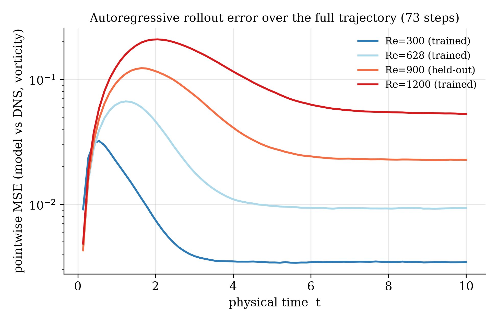
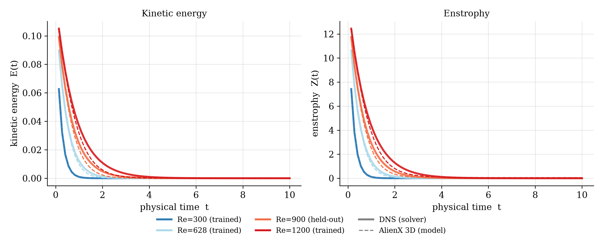
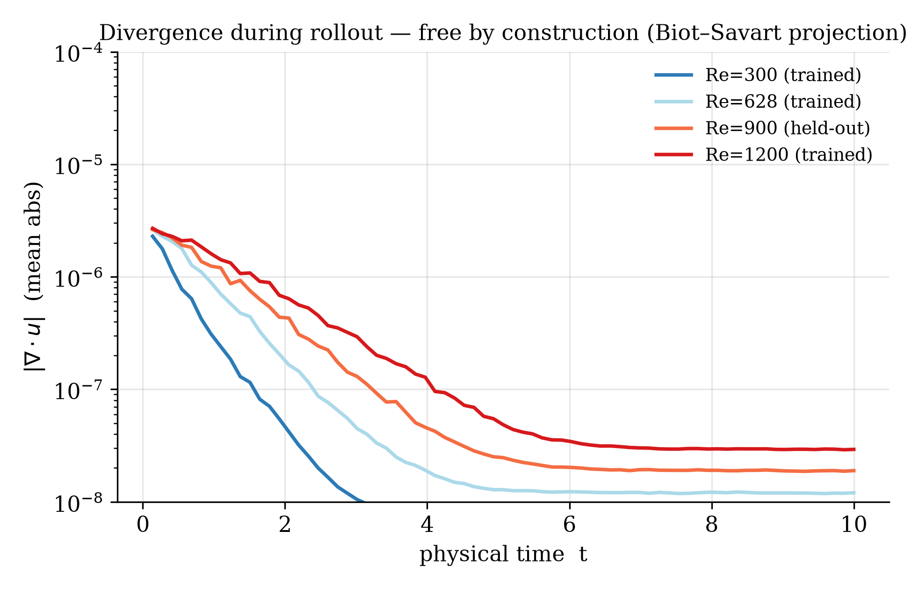

# AlienX 3D — SO(3)-Equivariant Neural Operator for 3D Physical Fields

A 421,507-parameter neural operator that learns 3D turbulence dynamics across
multiple Reynolds numbers in one model — **and generalizes zero-shot to a
regime it has never seen.**

> **The grid is dead. The manifold is awake.**

| | Re=900 **(zero-shot, never trained)** | Re=628 (trained) | Re=1200 (trained) |
|---|---|---|---|
| Single-step rel RMSE | **0.53%** | — | — |
| Rollout MSE growth (73 steps) | **5.30×** | 2.17× | 10.86× |
| Energy err (max) | **4.31%** | 2.68% | 5.81% |
| Enstrophy err (max) | **3.75%** | 2.28% | 4.98% |
| max \|∇·u\| | 2.6e−6 | 2.7e−6 | 2.7e−6 |

In-distribution (300/628/1200): **0.46% single-step rel RMSE** · QSA ablation
**32.81×** · **phase-only (gi=0) ablation on held-out Re=900: 4.74×** — the
complex phase channel of QSA carries predictive signal on regimes the model
never trained on.

Every Re=900 metric lands on the monotonic trend between the trained regimes.
The model interpolates the physics of an unseen regime — it learned a
Reynolds-family operator, not three trajectories.

## Rollout figures (from the released checkpoint)





Solid: spectral DNS solver. Dashed: AlienX 3D autoregressive rollout.
Divergence-free by construction at every step (float32 round-off ~3e−6):



Regenerate everything with:

```bash
python eval_re900_zero_shot.py --stage all   # all numbers on this card
python make_figures.py --stage A && python make_figures.py --stage B && python make_figures.py --stage plot
```

## Live demo

**[👉 AlienX Labs — Flow Lab](https://elbalor-alienx-labs.streamlit.app)** — race this
operator against a spectral Navier–Stokes solver at any Reynolds number in
[300, 1200], then flip *Sever the Phase* to delete QSA's complex channel live.
Source: [ElBalor/alienx-labs](https://github.com/ElBalor/alienx-labs) (Streamlit, free tier).

## Model description

AlienX 3D is a general geometric operator for 3D PDEs, demonstrated on
incompressible Navier-Stokes (Taylor-Green vortex, G=32, Re ∈ {300, 628, 1200}).
Four PDE-agnostic mechanisms, each structural rather than learned:

| Mechanism | What it does |
|---|---|
| **SO(3) local frame** | (e₁, e₂, n) from ∇k and the Hessian of the vorticity magnitude; inertia-tensor fallback with isotropic perturbation; Hessian-based in-plane orientation + sign lock |
| **Quantum Self-Attention (QSA)** | Hermitian interference S = q·conj(k), modulated by a complex geometric phase (in-plane angle → phase, wall-normal Gaussian × curvature confidence → amplitude), ℓ2-normalized over neighbors in CP^(n−1) — preserves phase, no softmax, native constructive/destructive interference |
| **Per-sample non-dimensionalization** | Each sample scaled by its own RMS velocity → scale-blind by construction; log(Re/Re_max) channel conditions regimes |
| **Biot–Savart feedback** | ω → u recovery in spectral space is exact → divergence-free **by construction** at every rollout step (float32 round-off ~2.7e−6) |

- **Parameters:** 421,507
- **Architecture:** input projection → 4 × QSA-ISN blocks (26-neighbor isotropic stencil) → equivariant output head
- **Task:** vorticity-velocity operator learning on 3D periodic domains  - **Training:** K-unroll curriculum K=1→2→3→5 with physics-informed losses (log-energy, log-enstrophy, divergence, radial spectra); released checkpoint is the epoch-55 K=3 stage (Colab T4 session timeout; see paper §5.2)

## Usage

```python
import torch, pickle
from huggingface_hub import hf_hub_download
from model import ISNOperator3D, get_isotropic_knn_3d_periodic
import physics as ph

G = 32
device = "cpu"

ckpt = hf_hub_download("ElBalor/AlienX-3D-ISN-Operator", "alienx_k5_best.pt")
stats = hf_hub_download("ElBalor/AlienX-3D-ISN-Operator", "alienx_k5_stats.pkl")

with open(stats, "rb") as f:
    SD = pickle.load(f)
ST, RE_MAX = SD["ST"], SD["RE_MAX"]

model = ISNOperator3D(hidden_dim=128, num_layers=4, num_heads=4,
                      re_max=RE_MAX).to(device)
model.G = G
model.load_state_dict(torch.load(ckpt, map_location=device))
model.eval()

# ground truth from the bundled pseudo-spectral DNS (~5 s)
KX, KY, KZ, K2 = ph.make_wavenumbers(G, device)
traj = ph.generate_tgv_dataset(G=G, nu=2*3.14159265/900, T=10.0, dt=0.005,
                               n_samples=74, device=device)  # Re=900!
cache_u = traj.to(device)
Us = ph.rms_velocity(cache_u)
omega = ph.velocity_to_vorticity(cache_u, KX, KY, KZ)

def _s(x, key):
    mu, sg = ST[key]; return (x - mu) / sg

t = 0
U0 = Us[t].clamp(min=1e-6)
om = omega[t:t+1] / U0
k_, gm, gv, Hs = ph.scalar_derivatives(om.norm(dim=-1), KX, KY, KZ)
knn = get_isotropic_knn_3d_periodic(G, device, dilation=max(1, G//16))
x = torch.arange(G, device=device, dtype=torch.float32) * (2*3.14159265/G)
X, Y, Z = torch.meshgrid(x, x, x, indexing="ij")
coords = torch.stack([X.flatten(), Y.flatten(), Z.flatten()], dim=-1).unsqueeze(0)

re_t = torch.tensor([900.0])  # the regime channel does the transfer
with torch.no_grad():
    pred = model(coords, _s(k_, "k"), _s(gv, "gv"), _s(gm, "gm"), _s(Hs, "H"),
                 _s(om.reshape(1, -1, 3), "om"),
                 _s((cache_u[t:t+1]/U0).reshape(1, -1, 3), "u"),
                 re_t, knn, G=G)
# pred: standardized next-step vorticity, equivariant in global coordinates
```

Or reproduce **every number on this card** end-to-end:

```bash
python eval_re900_zero_shot.py --stage all   # sanity gate + single-step + rollout + phase ablation
```

The harness first reproduces the in-distribution Re=300 paper number as a
sanity gate and refuses to emit new numbers if it fails. Runs on CPU (~8 min)
or any GPU (verified on 4 GB).

## Scope of the current release

- **Validated regime:** interpolation within Re ∈ [300, 1200] — Re=900
  zero-shot lands at 0.53%; behavior beyond Re_max is untested (§9.2).
- **Curriculum:** released checkpoint is the K=3 stage; the K=5 schedule is
  specified in §5.2/§11 and is the next training milestone.
- **Equivariance:** exact in the continuous formulation; arbitrary-angle
  numerical verification via rotated-grid evaluation is scheduled (§9.4).
- **Demonstrated on Taylor–Green vortex** — cross-PDE instantiation
  (MHD, Gross–Pitaevskii, Rayleigh–Bénard) follows the §10 substitution table.

The full debugging log — every numerical bug, root cause, and fix — is §8 of
the paper.

## Provenance

- **Paper:** [`PAPER.md`](https://huggingface.co/ElBalor/AlienX-3D-ISN-Operator/blob/main/PAPER.md) — complete, plain-language, LaTeX-free
- **Code:** [github.com/ElBalor/AlienX](https://github.com/ElBalor/AlienX) (S03-Invariance)
- **2D predecessor:** [ElBalor/AlienX-2D-Isotropic-Stencil](https://huggingface.co/ElBalor/AlienX-2D-Isotropic-Stencil) — bitwise-exact D4 equivariance
- **Attention mechanism:** [Quantum Self-Attention (QSA)](https://doi.org/10.5281/zenodo.22773015) (Zenodo) — the complex attention family AlienX 3D runs on
- Files: `alienx_k5_best.pt` (state_dict, 1.7 MB, float32) · `alienx_k5_stats.pkl` (normalization + config, required) · `model.py` + `physics.py` (importable) · `eval_re900_zero_shot.py` (full harness)
- Part of the **Grimoire of Elbàlor**

## Citation

```bibtex
@software{yaka2026alienx3d,
  author = {Yaka, Eric Heylel Danjuma},
  title  = {AlienX 3D: A General SO(3)-Equivariant Neural Operator for 3D Physical Fields},
  year   = {2026},
  url    = {https://github.com/ElBalor/AlienX}
}
```

---

Eric Yaka (Elbàlor / The Digital Necromancer) · Abuja, Nigeria · AGPL-3.0
